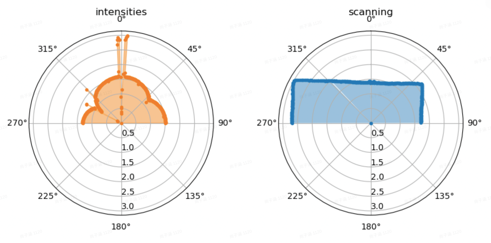
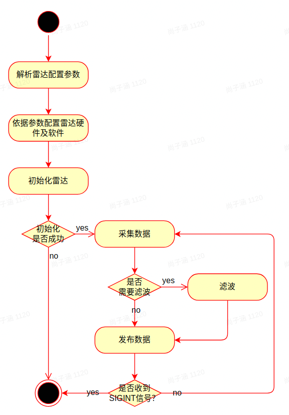
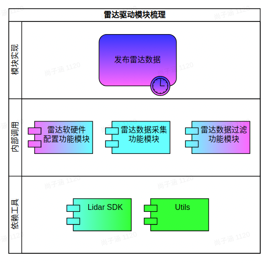

# <center>cyberdog_lidar 设计文档</center>
```
Copyright (c) 2023-2023 Beijing Xiaomi Mobile Software Co., Ltd. All rights reserved.

Licensed under the Apache License, Version 2.0 (the 'License');
you may not use this file except in compliance with the License.
You may obtain a copy of the License at

    http://www.apache.org/licenses/LICENSE-2.0

Unless required by applicable law or agreed to in writing, software
distributed under the License is distributed on an 'AS IS' BASIS,
WITHOUT WARRANTIES OR CONDITIONS OF ANY KIND, either express or implied.
See the License for the specific language governing permissions and
limitations under the License.
```
## <font color=Blue size=4> 目录 </font>
* [1. 修订](#1-修订)
* [2. 概述](#2-概述)
* [3. 设计](#3-设计)
> * [3.1. 功能设计](#31-功能设计)
> * [3.2. 模块设计](#32-模块设计)
---
## 1. 修订

<center>

项目|软件版本|协议版本|修订日期|修订人员|备注
:--:|:--|:--|:--:|:--:|:--:
雷达驱动|V1.1.0.0|V1.0.0.0|2023-02-06|尚子涵|无

</center>

## 2. 概述

<center>



</center>

> 如上图所示，仿生机器人雷达驱动主要用于：需要实时反馈仿生机器人所处环境中的障碍物距离及距离探测值强度信息的场景。

## 3. 设计
### 3.1. 功能设计

<center>



</center>

> 如上图所示，  仿生机器人雷达驱动工作流程主要如下：
1. 解析雷达配置参数并按照参数配置雷达软硬件；
2. 初始化雷达；
3. 如果初始化成功则继续下一步反之退出；
4. 采集雷达原始数据；
5. 如果需要滤波则对雷达原始数据进行过滤（拖尾滤波）并发布，反之直接发布原始数据；
6. 如果程序收到终止信号则退出，反之进行第4步。

#### 3.2 模块设计

<center>



</center>

> 如上图所示，  仿生机器人雷达驱动架构组成及各组成部分主要功能如下：
1. Lidar SDK：提供 Linux 下雷达固件数据采集及解析功能；
2. Utils：提供常用工具，如日志；
3. 雷达软硬件配置功能模块：提供雷达硬件及软件的配置功能；
4. 雷达数据采集功能模块：提供雷达数据采集及解析功能；
5. 雷达数据过滤功能模块：提供雷达数据过滤（拖尾滤波）功能；
6. 发布雷达数据：提供雷达数据发布功能。

---
---

# <center>cyberdog_interactive design document</center>
```
Copyright (c) 2023-2023 Beijing Xiaomi Mobile Software Co., Ltd. All rights reserved.

Licensed under the Apache License, Version 2.0 (the 'License');
you may not use this file except in compliance with the License.
You may obtain a copy of the License at

    http://www.apache.org/licenses/LICENSE-2.0

Unless required by applicable law or agreed to in writing, software
distributed under the License is distributed on an 'AS IS' BASIS,
WITHOUT WARRANTIES OR CONDITIONS OF ANY KIND, either express or implied.
See the License for the specific language governing permissions and
limitations under the License.
```
## <font color=Blue size=4> directory </font>
* [1. Revise](#1-revise)
* [2. Overview](#2-overview)
* [3. Design](#3-design)
> * [3.1. Feature design](#31-feature-design)
> * [3.2. modular design](#32-modular-design)
---
## 1. Revise

<center>

Item|Software Version|Protocol Version|Revision Date|Reviser|Remarks
:--:|:--|:--|:--:|:--:|:--:
cyberdog_lidar|V1.1.0.0|V1.0.0.0|2023-02-06|ShangZihan|none

</center>

## 2. Overview

<center>


</center>

> As shown in the figure above, the bionic robot radar driver is mainly used in scenarios where real-time feedback of obstacle distance and distance detection value intensity information in the bionic robot's environment is required.

## 3. Design
### 3.1. Feature design

<center>


</center>

> As shown in the figure above, the workflow of the bionic robot radar driver is mainly as follows:
1. Analyze the radar configuration parameters and configure the radar software and hardware according to the parameters;
2. Initialize the radar;
3. If the initialization is successful, continue to the next step, otherwise exit;
4. Collect raw radar data;
5. If filtering is required, filter the raw radar data (smearing filter) and release it, otherwise release the original data directly;
6. If the program receives the termination signal, exit, otherwise, go to step 4.

### 3.2 Technology architecture

<center>


</center>

> As shown in the figure above, the composition of the bionic robot radar drive architecture and the main functions of each component are as follows:
1. Lidar SDK: Provides radar firmware data collection and analysis functions under Linux;
2. Utils: Provide common tools, such as logs;
3. Radar software and hardware configuration function module: provide radar hardware and software configuration functions;
4. Radar data acquisition function module: provide radar data acquisition and analysis functions;
5. Radar data filtering function module: provide radar data filtering (smearing filter) function;
6. Release radar data: Provide radar data release function.